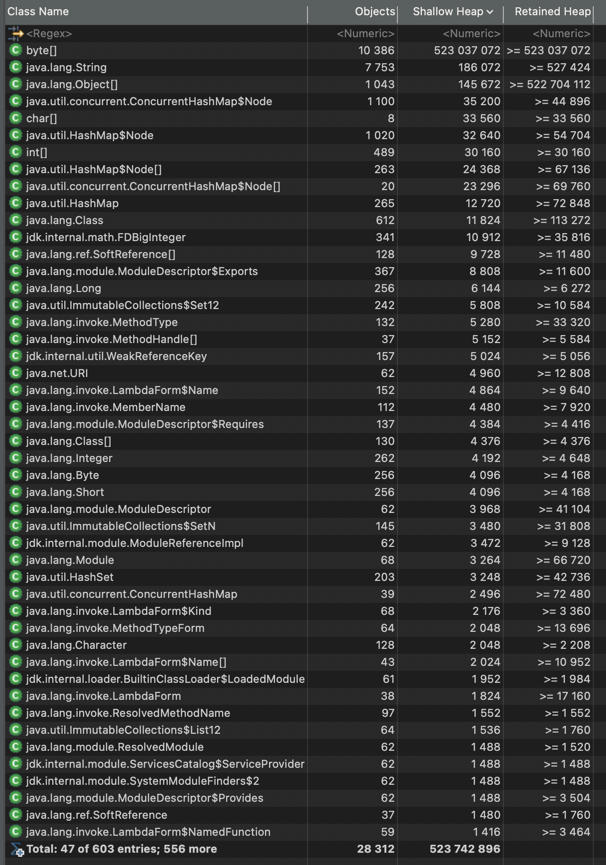
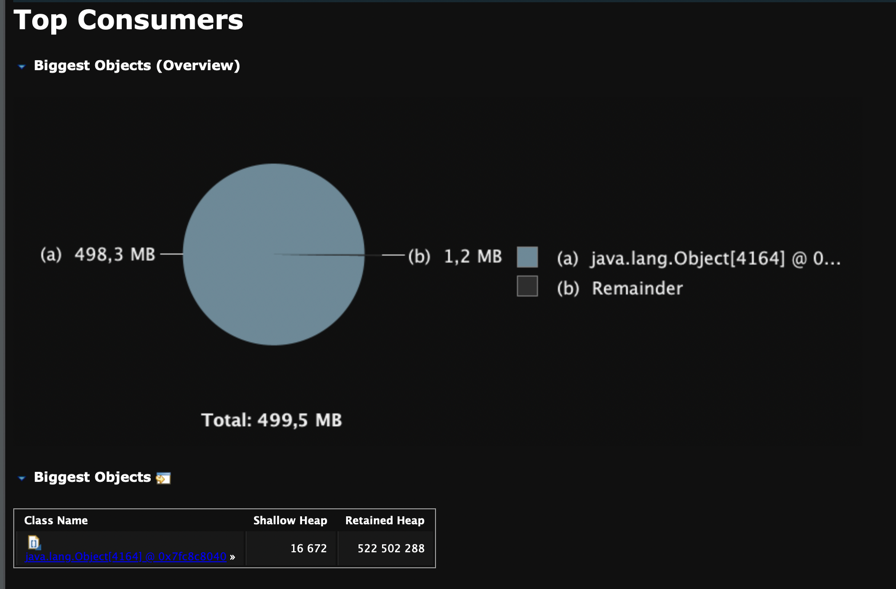

# Практическая работа: анализ OutOfMemoryError с помощью Heap Dump и Eclipse Memory Analyzer

## Цель работы

Изучить механизм диагностики ошибок нехватки памяти в Java-приложениях с использованием:

* Heap Dump;
* Eclipse Memory Analyzer (MAT);
* отчета Leak Suspects Report.

---

## Подготовка эксперимента

Для демонстрации проблемы нехватки памяти был использован класс `LoadSimulatorWithOOM`.

Приложение выполняет следующие действия:

1. Создает объекты `byte[]` размером 200 KB.
2. Сохраняет их в статическом `ArrayList`.
3. Постепенно увеличивает объем занимаемой памяти.
4. Периодически создает временные объекты для дополнительной нагрузки на GC.
5. Продолжает работу до полного исчерпания доступной памяти JVM.

### Параметры запуска

```bash
java -Xmx512m -Xms512m \
-XX:+UseG1GC \
-XX:+HeapDumpOnOutOfMemoryError \
-XX:HeapDumpPath=./oom_heap.hprof \
-Xlog:gc*:file=gc.log \
ru.alfabank.ipr.GC.LoadSimulatorWithOOM
```

### Назначение параметров

| Параметр                          | Описание                                  |
| --------------------------------- | ----------------------------------------- |
| `-Xms512m`                        | Начальный размер Heap                     |
| `-Xmx512m`                        | Максимальный размер Heap                  |
| `-XX:+UseG1GC`                    | Использование сборщика мусора G1          |
| `-XX:+HeapDumpOnOutOfMemoryError` | Автоматическое создание Heap Dump при OOM |
| `-XX:HeapDumpPath`                | Путь сохранения Heap Dump                 |
| `-Xlog:gc*`                       | Логирование работы GC                     |

---

## Возникновение OutOfMemoryError

После запуска приложение постепенно заполняло память объектами `byte[]`.

Поскольку объекты сохранялись в статическом списке `oldGen`, они оставались достижимыми для JVM и не могли быть удалены сборщиком мусора.

В результате свободная память Heap была полностью исчерпана, после чего JVM выбросила исключение:

```text
java.lang.OutOfMemoryError: Java heap space
```

Одновременно был автоматически сформирован файл:

```text
oom_heap.hprof
```

---

# Анализ Heap Dump в Eclipse Memory Analyzer

Полученный Heap Dump был открыт в Eclipse Memory Analyzer (MAT).

Для автоматического поиска проблем использовался отчет:

```text
Leak Suspects Report
```

---

## Основной подозреваемый объект

MAT обнаружил следующий объект:

```text
One instance of java.lang.Object[]
occupies 522 502 288 (99.76%) bytes
```

Это означает, что единственный объект типа `Object[]` занимает:

* 522 MB памяти;
* 99.76% всего Heap.

### Вывод

Практически вся память приложения была занята одним большим массивом объектов.

---

## Цепочка удержания памяти

MAT показал следующую цепочку ссылок:

```text
Thread (main)
    ↓
ArrayList
    ↓
Object[]
    ↓
byte[]
```

Объект удерживался главным потоком приложения:

```text
java.lang.Thread @ main
```

Поскольку ссылка на список продолжала существовать, JVM считала все элементы списка достижимыми и не могла освободить память.

---

## Анализ стека вызовов

В отчете были обнаружены вызовы:

```text
java.util.Arrays.copyOf(...)
Arrays.java:3513

java.util.Arrays.copyOf(...)
Arrays.java:3482
```

### Что это означает

Внутри `ArrayList` элементы хранятся в массиве:

```java
Object[]
```

Когда массив заполняется, происходит его расширение:

```java
Arrays.copyOf(...)
```

Во время расширения создается новый массив большего размера и в него копируются существующие элементы.

Схематично процесс выглядит следующим образом:

```text
Object[1000]
        ↓
Object[1500]
        ↓
Object[2250]
        ↓
Object[3375]
        ↓
...
```

Каждое расширение требует дополнительной памяти.

---

## Анализ Histogram

В разделе Histogram наблюдается аналогичная картина.



Наибольшее количество памяти занимают объекты:

| Класс  | Количество |
| ------ | ---------: |
| byte[] |     10 386 |

Именно массивы `byte[]` формируют основную часть Heap.

### Вывод

Приложение хранит большое количество крупных массивов байт, которые не удаляются сборщиком мусора.

---

## Анализ Largest Objects

В разделе Largest Objects отображаются самые крупные объекты Heap.



Результаты подтверждают выводы отчета Leak Suspects Report:

* крупнейшим объектом является внутренний массив `Object[]`;
* через него удерживаются все созданные объекты `byte[]`;
* данный объект занимает практически всю доступную память JVM.

---

# Причина возникновения OutOfMemoryError

Основная проблема заключается в следующем:

```java
private static final List<byte[]> oldGen = new ArrayList<>();
```

В процессе работы приложения в список постоянно добавляются новые объекты:

```java
oldGen.add(new byte[1024 * 200]);
```

При этом список практически никогда не очищается.

В результате:

1. Количество объектов непрерывно растет.
2. Размер внутреннего массива `ArrayList` увеличивается.
3. Выполняются операции `Arrays.copyOf(...)`.
4. Heap постепенно заполняется.
5. При очередном расширении массива свободной памяти оказывается недостаточно.
6. JVM выбрасывает `OutOfMemoryError`.

---

# Что показал Heap Dump

В ходе анализа Heap Dump было установлено:

* практически вся память Heap занята одним объектом `Object[]`;
* данный массив является внутренним хранилищем `ArrayList`;
* через него удерживаются более 10 тысяч объектов `byte[]`;
* суммарный объем удерживаемой памяти составляет около 522 MB;
* объекты остаются достижимыми и не могут быть удалены сборщиком мусора;
* причиной аварийного завершения приложения стало исчерпание памяти во время очередного расширения внутреннего массива `ArrayList`.

---

# Итоговый вывод

В ходе работы был исследован механизм возникновения ошибки `OutOfMemoryError` и выполнен анализ Heap Dump с помощью Eclipse Memory Analyzer.

Использование отчета Leak Suspects Report позволило быстро выявить объект, занимающий практически всю память приложения. Анализ показал, что причиной аварийного завершения стала неконтролируемая аккумуляция объектов `byte[]` в коллекции `ArrayList`.

Полученный Heap Dump наглядно демонстрирует типичный сценарий утечки памяти, когда объекты продолжают удерживаться через существующие ссылки и становятся недоступными для сборщика мусора, что в конечном итоге приводит к исчерпанию памяти JVM.
