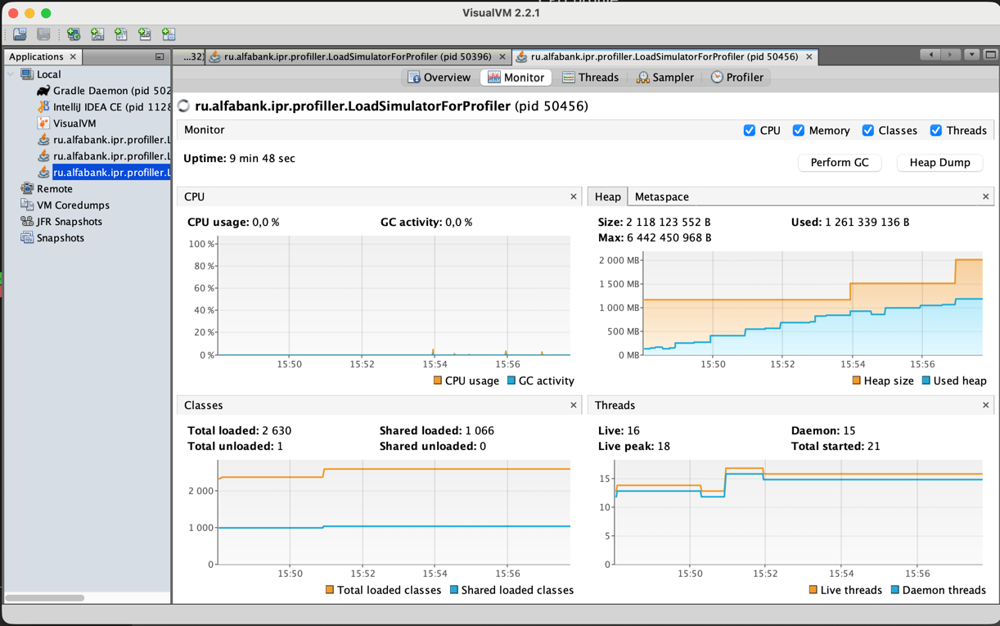
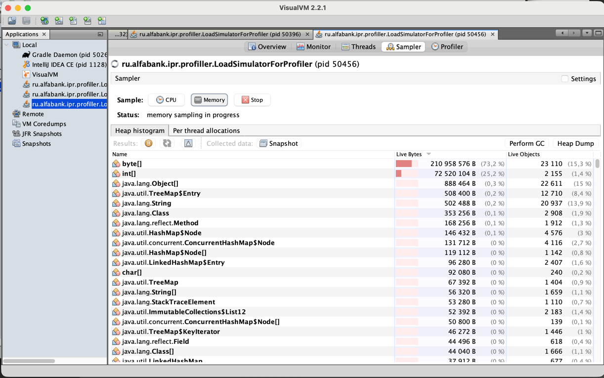
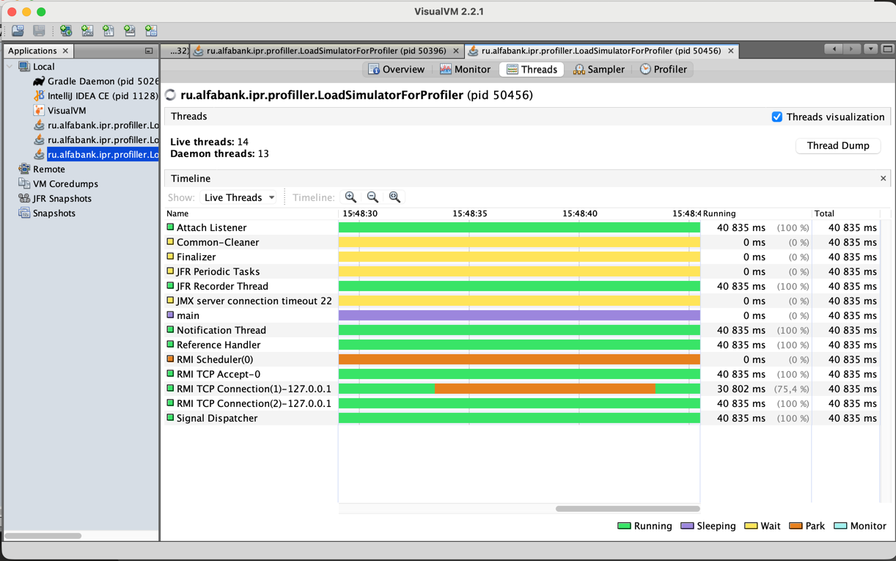
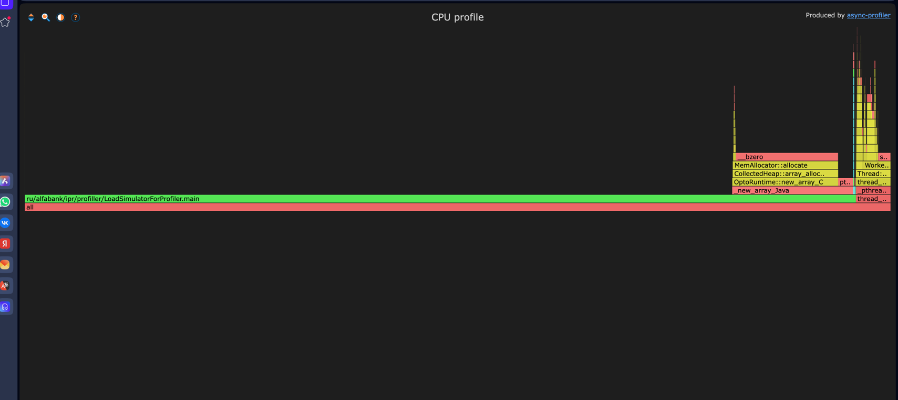

# Практическая работа: анализ работы Java-приложения с использованием VisualVM и async-profiler

## Цель работы

Изучить возможности профилирования Java-приложений с помощью инструментов **VisualVM** и **async-profiler**, а также провести анализ использования процессора, памяти и распределения объектов в куче JVM.

---

## Описание исследуемого приложения

В рамках практической работы использовалось тестовое приложение, которое постепенно создает объекты типа `byte[]` и сохраняет их в памяти.

Основная задача приложения — имитировать рост потребления памяти для последующего анализа поведения JVM и инструментов профилирования.

---

# 1. Мониторинг приложения в VisualVM

## Использование CPU



### Наблюдения

По графику видно:

* загрузка процессора практически отсутствует;
* активность сборщика мусора (GC) близка к нулю;
* значительных скачков нагрузки не наблюдается.

### Вывод

Приложение не испытывает существенной процессорной нагрузки и большую часть времени выполняет простые операции по созданию и хранению объектов в памяти.

---

## Использование Heap



### Наблюдения

* используемая память постепенно увеличивается;
* объем занятой памяти достиг примерно **1.2 ГБ**;
* максимальный размер кучи увеличивался ступенчато до **≈ 2 ГБ**;
* освобождение памяти происходит редко;
* график имеет устойчивый возрастающий характер.

### Вывод

Наблюдается интенсивное накопление объектов в куче. Это свидетельствует о наличии объектов с длительным временем жизни, которые продолжают оставаться доступными и не удаляются сборщиком мусора.

---

## Анализ потоков



### Показатели

| Метрика        | Значение |
| -------------- | -------: |
| Live Threads   |       16 |
| Peak Threads   |       18 |
| Daemon Threads |       15 |

### Вывод

Количество потоков остается стабильным на протяжении всего времени работы приложения и не оказывает заметного влияния на производительность.

---

## Анализ загруженных классов

### Показатели

| Метрика        | Значение |
| -------------- | -------: |
| Loaded Classes |     2630 |

### Наблюдения

Количество загруженных классов практически не изменяется во время выполнения приложения.

### Вывод

Дополнительная динамическая загрузка классов отсутствует. Приложение использует заранее загруженный набор классов без существенных изменений во время работы.

---

# 2. Анализ памяти (Memory Sampling)

Для анализа распределения памяти использовалась вкладка **Sampler** в VisualVM.

### Результаты

| Тип объекта          |   Размер |
| -------------------- | -------: |
| `byte[]`             | 210.9 МБ |
| `int[]`              |  72.5 МБ |
| `java.lang.Object[]` |  0.89 МБ |
| `String`             |  0.50 МБ |

### Основные потребители памяти

| Тип      | Доля памяти |
| -------- | ----------: |
| `byte[]` |       73.2% |
| `int[]`  |       25.2% |

Суммарно массивы занимают более **98% всей используемой памяти**.

### Вывод

Основным потребителем памяти являются массивы примитивных типов (`byte[]` и `int[]`), что соответствует логике исследуемого приложения, которое специально генерирует большое количество массивов для демонстрации роста потребления памяти.

---

# 3. Профилирование CPU с помощью async-profiler

Для более детального анализа работы JVM был использован инструмент **async-profiler**.

## Flame Graph



### Обнаруженные вызовы

На графике наблюдаются следующие функции:

```text
new_array_Java
CollectedHeap::array_allocate
MemAllocator::allocate
OptoRuntime::new_array_C
```

Также присутствует вызов:

```text
bzero
```

который отвечает за инициализацию выделенной памяти при создании новых массивов.

### Анализ результатов

Flame Graph показывает, что основная активность JVM связана с:

* выделением памяти под массивы;
* инициализацией памяти;
* работой подсистемы управления кучей JVM.

При этом отсутствуют ресурсоемкие вычисления или сложная бизнес-логика.

### Вывод

Большая часть времени выполнения приложения связана с созданием новых массивов и выделением памяти. Процессорные ресурсы расходуются преимущественно на операции управления памятью, а не на вычисления.

---

# Итоговые выводы

В ходе выполнения практической работы были изучены возможности профилировщиков **VisualVM** и **async-profiler**.

Полученные результаты показывают, что:

* приложение практически не нагружает процессор;
* количество потоков остается стабильным;
* динамическая загрузка классов отсутствует;
* наблюдается постоянный рост использования Heap-памяти;
* основную часть памяти занимают объекты типа `byte[]` и `int[]`;
* Flame Graph подтверждает, что основная активность JVM связана с выделением памяти и созданием массивов.

Таким образом, проведенный анализ демонстрирует типичное поведение приложения с высокой нагрузкой на память и позволяет на практике изучить инструменты профилирования Java-приложений.
